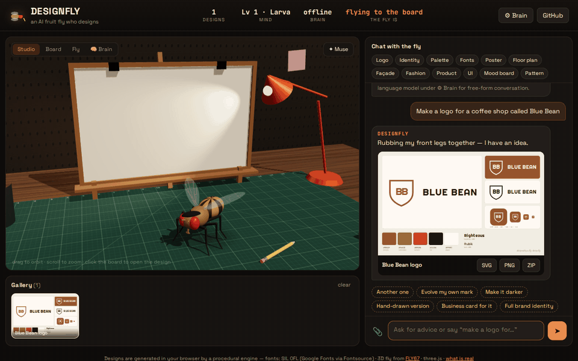
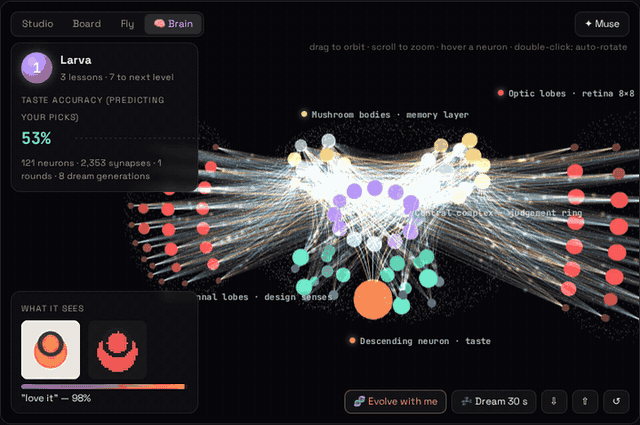
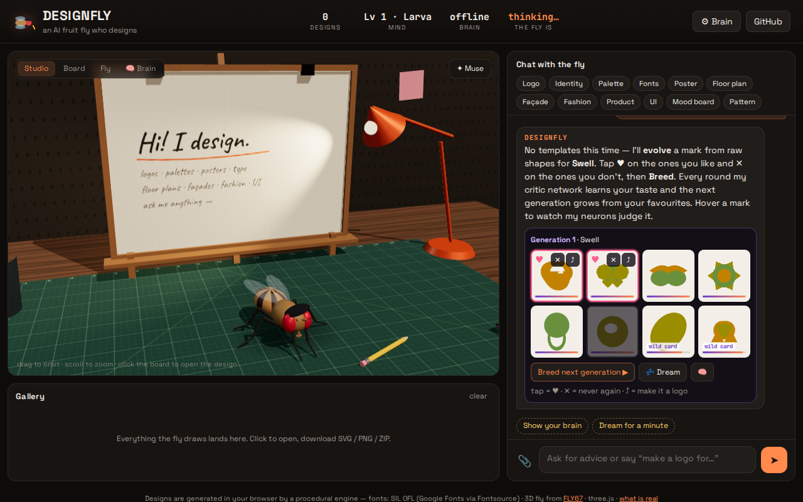
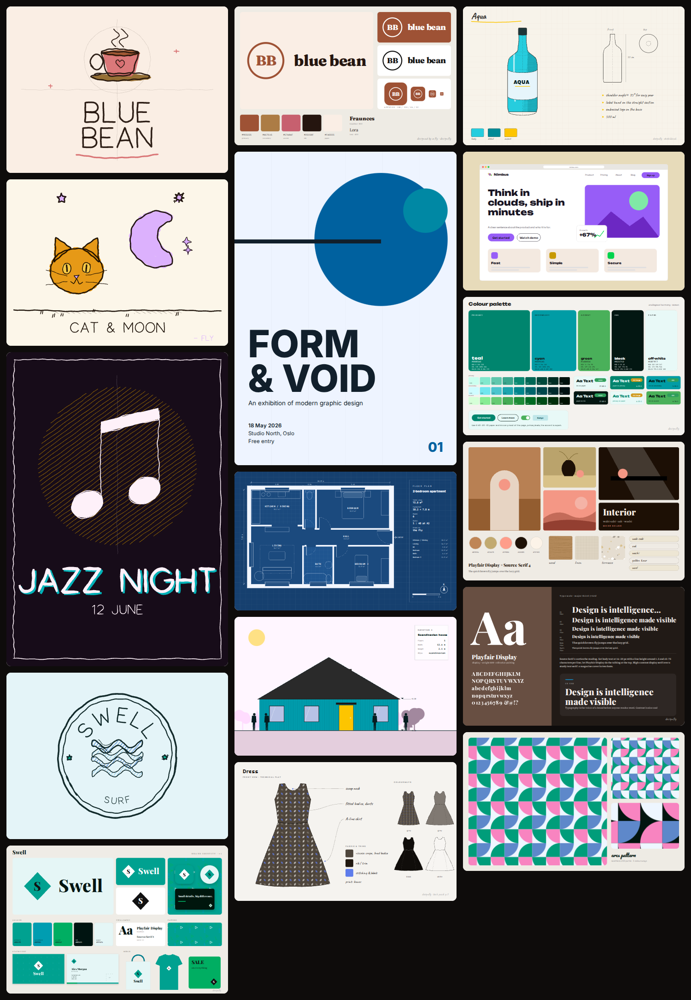
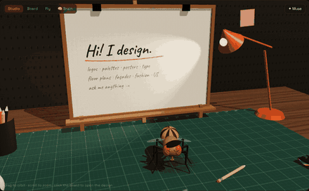

# DESIGNFLY 🪰✏️

**An AI fruit fly who designs.** A 3D fly in a beret lives in a little design studio in your browser. Ask it anything about design — or ask it to *make* something: it flies to the easel and **draws it by hand, stroke by stroke** — crooked lines, colour that misses the outline, its own handwriting — and hands you the files.

Logos · brand identities · colour palettes · font pairings · posters · business cards · seamless patterns · floor plans · building façades · fashion tech flats · product sketches · UI mockups · mood boards — all downloadable as **SVG** (fonts embedded), **PNG** (up to ~16 megapixels) and **ZIP** bundles.



**[▶ Live demo](https://znatgost.github.io/designfly/)** · [video (mp4)](docs/demo.mp4) · [screenshot](docs/screenshot.png)

No server. No build step. No API key required — the fly thinks offline by default, and you can plug in a language model if you want open-ended conversation.

---

## It draws by hand ✍️

Logos, posters, business cards, pattern sheets and free drawings (*"draw a cat looking at the moon"*, *«нарисуй ракету»*) are **not templates**: the fly decides what to draw and where, then draws every line itself.

- **What to draw.** ~60 things it knows how to draw (cup, croissant, kolobok, cat, dog, fish, rocket, robot, house, wave, mountain, flower, the fly itself…), picked from your words (English or Russian), the brand name and the industry. Each is built from strokes with proportions and details decided on the spot, so no two cats come out alike. Something it has never seen (*"draw a giraffe"*) becomes an invented creature — and it says so.
- **How it draws.** Every stroke goes through a wobbly "hand": lines drift and overshoot, circles don't quite close, the nib is a pen, marker or brush, colour goes in afterwards as flat marker, riso misregistration, watercolour wash, hatching or scribble. Lettering is a single-stroke alphabet (Latin + Cyrillic) written by the same hand — no fonts.
- **Where things go.** Layouts are chosen per drawing (stacked, side-by-side, badge with lettering on a circle, the mark replacing an "O", monogram, wordmark; hero / grid / big type / scatter posters); scattered elements are placed by best-candidate search so they don't collide.
- **Live.** The stroke list *is* the drawing: on the easel you watch it happen in order — faint pencil guides, outlines, lettering, then colouring in — with the pencil tinted to the current colour.
- **It learns.** 👍 / 👎 on a hand-drawn design shifts which layouts, nibs, colouring and lettering it reaches for; every drawing is practice, so the **hand** stat (steadiness) climbs and lines get calmer. No obvious object for a brand? It draws the favourite mark of its evolved mind instead.
- Say **"template version"** for the clean engine (or switch hand-drawing off in ⚙ Brain), **"draw it by hand"** to go back.

## It paints 🖌

*"Paint the studio"*, *«напиши автопортрет»*, *"abstract painting"*, *"paint a cat"*, or attach a photo and say *"paint this"*.

- **It looks first.** The reference is real: the fly renders the 3D studio from its own point of view (a corner with the lamp and your mug, the whole room — or itself, for a self-portrait), takes your photo, recalls its own sketch of the subject, or imagines a colour field around one of the shapes its mind evolved. You can download *what it looked at* next to the painting.
- **Then it paints, stroke by stroke.** It squeezes a few tubes of paint from the colours it sees and mixes each colour from two of them. Big brush first, smaller ones later. Every stroke starts where its canvas differs most from what it sees and is pulled along the edges of the form. Before committing a stroke it checks that the stroke actually brings the canvas closer (a beginner skips the check now and then). No recipes, no templates — the same scene never comes out the same twice.
- **It learns.** Skill grows with every painting and every 👍: more layers, finer brushes, more tubes, more precise mixing, a steadier hand. The *likeness* to what it saw is reported on each painting, so you can watch it climb. 👍 / 👎 also tune its brushwork (broad, fine, dabs, scribble), colour (true, warm, cool, vivid, muted) and ground (white, sienna, grey, paper).
- The board replays the painting live, coarse to fine; the gallery stores the small reference and repaints it on reload.

## The fly's own mind 🧠



Besides the template engine, the fly has a **mind of its own** that invents marks *without templates* and **learns your taste**:

- **Evolution.** Say *"evolve a logo for Swell"*. The mind builds marks gene by gene from raw primitives (circles, rings, arcs, petals, blobs, bars, stars, cut-outs, symmetry rules) and shows you 8. Tap ♥ on what you like, ✕ on what you don't, press **Breed** — the next generation is bred from your favourites by mutation and crossover. ⤴ turns any mark into a full logo (and then a business card, identity…).
- **A critic network that learns.** Every mark is seen through an 8×8 retina plus 20 measured design senses (symmetry, balance, negative space, small-size legibility, colour contrast…) and judged by a small neural network (84 → 24 → 12 → 1, written from scratch, no ML library). Each round it is trained on your choices (pairwise preferences, Bradley–Terry loss, Adam). Before learning, it first predicts what you'll pick — that's the **taste accuracy** you see climbing.
- **Instinct.** A newborn mind isn't blank: it's first trained to imitate a handful of written design rules, so the first generation is already sensible. Your ratings gradually override the instinct.
- **Dreaming.** Say *"dream"* and it keeps evolving on its own for a while, judging with its current taste, then shows its favourites. Dreaming improves the *designs*; only your ratings change the *judge*.
- **Levels.** Larva → Pupa → Intern → … → Creative director → Legend, by lessons learned.
- **3D brain.** 🧠 **Brain** shows every neuron and all 2,353 synapses placed in a fly-brain-shaped head: the retina on the optic lobes, design senses in the antennal lobes, a memory layer in the mushroom bodies, a judgement ring in the central complex and one descending **taste neuron**. Activity flows layer by layer when it looks at a mark (hover any mark in the chat), synapses are coloured by weight (warm = excitatory, blue = inhibitory) and flash where learning changed them. Hover a neuron to see what it measures, its strongest inputs and the mark that excites it most.
- The mind lives in your browser (localStorage). ⇩ / ⇧ export and import it as JSON — share a trained fly with a friend.



## What it makes



| Ask | You get | Downloads |
|---|---|---|
| *logo for a coffee shop called Blue Bean* | hand-drawn logo (6 layouts) + mono and reversed versions — or, as *template version*, a combination / wordmark / monogram / emblem logo with app-icon & favicon test | SVG, PNG, ZIP |
| *draw a cat looking at the moon* · *нарисуй ракету* | a freehand drawing with a caption | SVG, PNG |
| *paint the studio* · *напиши автопортрет* · a photo + *paint this* | a brush painting, from life, your photo, memory or an abstraction | SVG, PNG, ZIP with what it looked at |
| *brand identity for a surf school called Swell* | logo system, palette, type, pattern, business card, tote, tee, social post | ZIP: logos, card front/back, pattern tile, text brand guide |
| *colour palette for a calm spa* · *palette from #2b6de0* | 5-role palette, tint ramps, WCAG contrast checks, UI preview | SVG, PNG, `palette.css`, `palette.json` |
| *font pairing for a law firm* | specimen, modular type scale, "in use" card | `typography.css` with Google Fonts import + tokens |
| *swiss poster "Form & Void"* | A-series poster: Swiss, Bauhaus, minimal, brutalist, gradient, retro, editorial | SVG, PNG |
| *business card for Atelier Nord* | front + back mockup, 85 × 55 mm | card-front.svg, card-back.svg |
| *terrazzo pattern in pink* | seamless tile in 3 colourways (14 pattern types) | tile SVGs |
| *2-bedroom apartment floor plan, 70 m², blueprint* | zoned plan: hall, doors with swings, windows, furniture, dimensions, room schedule, north arrow, scale bar | SVG, PNG |
| *brutalist façade with 6 floors* | street elevation (modern, scandinavian, classic, brutalist, tower) with 1.75 m figures and level markers | SVG, PNG |
| *hoodie flat with a graphic print* | tech-pack flat (tee, hoodie, dress, trousers, skirt, bomber) with callouts, colourways, trims | SVG, PNG, single flat |
| *sketch a ceramic vase* | marker sketch with hatching + front/top orthographic views (vase, bottle, mug, lamp, chair) | SVG, PNG |
| *landing page for Nimbus, an AI startup* · *wireframe* | mobile screens, landing page or dashboard, hi-fi or grey wireframe | SVG, PNG |
| *japandi interior mood board* | collage, material swatches (wood, linen, marble, terrazzo, velvet, brass…), palette, keywords | SVG, PNG |

Then keep talking like you would to a designer: **"make it darker"**, **"another one"**, **"hand-drawn version"**, **"serif type"**, **"call it Nordlys"**, **"add a bedroom"**, **"taller"**, **"stripes instead"**, **"now a business card for it"** — the fly remembers the current brand and builds on it.

Every design has a **↻ variation** button; hand-drawable kinds switch between **✎ drawn by hand** and **▭ template**, the rest have a pencil-on-paper filter.

## What it answers

A hand-written design knowledge base (~50 topics) plus a few calculators:

- **Graphic design & branding** — what makes a good logo, logo types, the logo process, identity kits, naming.
- **Colour** — harmonies, psychology, 60-30-10, CMYK vs RGB, gradients; *"what goes with teal?"* returns real swatches.
- **Accessibility** — *"contrast #777 on #fff"* → ratio, WCAG grade, and the nearest colour that passes.
- **Typography** — pairing (*"what goes with Montserrat?"*), hierarchy, kerning, *"type scale 18 px 1.333"*.
- **Layout** — grids, composition, whitespace, Gestalt, golden ratio.
- **UI/UX** — principles, landing pages, dark mode, design systems, icons.
- **Print & files** — bleed, DPI, *"A3 at 300 dpi in pixels"*, *"instagram story size"*, SVG vs PNG.
- **Architecture & interiors** — zoning, circulation, room sizes, façades, lighting in kelvin, interior styles.
- **Fashion** — process, tech packs, fabrics & gsm, colour in outfits, croquis proportions.
- **Product design**, packaging, portfolio, pricing, feedback, design history.
- **Image critique** — drop / paste an image: palette (k-means), contrast, brightness, saturation, busyness, whitespace, visual balance — and *"palette from this image"*.

## The studio



The 3D fly is the articulated *Drosophila* from **[FLY67](https://github.com/znatgost/fly67)** (18 leg joints, iridescent wings, compound eyes, proboscis) — now with a beret. It wanders over a cutting mat, rubs its front legs together while it thinks, waggles its antennae and proboscis while it talks, flies up to the easel and draws your design band by band with a pencil held in its front legs, lands, and points at the result. The swatch fan on the desk takes the colours of the latest design.

**Looking for the muse.** Say *"inspire me"* (or press **✦ Muse**) and the fly takes off to hunt for inspiration around the studio — it sniffs the pencil cup, the coffee mug, the swatch fan, the sticky notes on the wall, and, being a fly, can't resist circling the desk lamp. When the muse strikes, a spark pops above its head and it tells you the idea it found (*"the crema in your coffee gave me an idea: an emblem logo for a coffee shop called Crema"*) — one tap on **Draw this idea** and it draws it. When it's bored it goes looking on its own and leaves the idea as a ✦ suggestion chip.

Camera: *Studio* / *Board* / *Fly* views, drag to orbit, scroll to zoom, click the board to open the design.

## Brains: offline or bring your own model

| Brain | How it works |
|---|---|
| **Offline** (default) | Rule-based intent parser (English + basic Russian keywords) → the procedural design engine; knowledge base + calculators for advice. Instant, private, works on a plane. |
| **OpenAI / Anthropic / Gemini / OpenRouter / any OpenAI-compatible** (Ollama, LM Studio…) | The model chats freely (any language, vision for critique) and draws by emitting a ```` ```design {json} ```` block for the engine — or, for things the engine can't do, a freehand ```` ```svg ```` that is sanitised before display. |

Set it in **⚙ Brain**. The key is stored only in your browser (`localStorage`) and sent only to the provider you pick. If a call fails, the fly falls back to its offline brain.

## What is real and what is not

Honesty about this is part of the project.

**Real**
- Every design is **generated in your browser** by a procedural engine written for this project: seeded, deterministic (same spec + seed → same file), pure SVG strings — no image model, no stock art, no server.
- Colour work uses **OKLCH** (perceptual) with gamut mapping; contrast numbers are the **WCAG 2.x** formula.
- Floor plans follow real planning logic (public/private zoning, a circulation spine, grouped wet rooms, doors off the hall, windows on exterior walls) and dimensions are in metres.
- Exported SVGs **embed the exact fonts** they use (SIL OFL, vendored from Fontsource), so they look identical in Figma, Illustrator, Inkscape or a browser.

**Simplified**
- The offline "AI" is a **rule-based** parser and a curated knowledge base, not a neural network. It understands a lot of design phrasing but not everything — plug in a model for free-form chat.
- Identities, palettes, type, floor plans, façades, fashion, product, UI and mood boards come from the **template engine**: marks, layouts and typologies are hand-designed; name, industry, mood, colours, style and seed drive the choices.
- **Paintings** are painted from a real reference, but the fly has no idea *what* it paints — it matches colours and edges, it doesn't understand objects. Its learning is a skill curve plus preference weights, not a neural net.
- The **freehand engine** draws for real, but from a vocabulary of ~60 things it knows how to construct out of strokes — it is not an image model. It doesn't see what it draws (except the evolved marks, which the mind judges), and its "learning" of the hand is a preference weighting over styles plus a practice counter, not a neural net. Crooked is on purpose.
- Floor plans and façades are **concept sketches**, not construction documents: no structure, codes or stairs.
- Mood-board "photos" are abstract placeholders for atmosphere.
- The 3D fly is **animated**, not simulated — unlike FLY67, there is no connectome driving it here.
- The **mind is real but small**: 121 neurons trained only on your ratings (plus the rule-based instinct). It learns *your* taste, not "objectively good design", and it won't reach the level of big image models. Its marks are built from ~12 primitive types, so it invents compositions, not illustrations. The 3D brain is the actual network — positions are arranged to look like a fly brain, but these are not real *Drosophila* neurons.

## Run it

```bash
git clone https://github.com/znatgost/designfly && cd designfly
npm start                 # any static server works: python3 -m http.server
# open http://localhost:8080
```

```bash
npm test                  # engine (14 kinds × 25 seeds), freehand engine + every motif, colour math, intents, LLM sanitising, MLP gradient check, the mind learning a simulated taste
npm run fonts             # re-vendor fonts/ from @fontsource
npm run three             # rebuild the tree-shaken three.js bundle
python3 tools/capture.py --what demo|muse|shot|gallery|brain|evolve   # regenerate docs/ media
python3 tools/make_icons.py                 # favicons, Apple touch icon, PWA icons, social preview
```

Scripting from the console: `designfly.say('logo for a bakery called Crumb')`, `designfly.make({kind:'poster', style:'bauhaus', name:'Open Studio'})`.

## Architecture

```
index.html
src/
  app.js          UI glue: chat, gallery, viewer, downloads, settings; window.designfly hook
  brain.js        offline brain: intent → reply, design specs, follow-up chips, fly mood; calculators; critique text
  intents.js      natural language → { create | modify | advice … } + spec (name, industry, moods, colours, styles, numbers)
  knowledge.js    ~50 design topics with keyword retrieval
  llm.js          bring-your-own-model: OpenAI / Anthropic / Gemini / OpenRouter / OpenAI-compatible; reply parsing; SVG sanitiser
  critique.js     image analysis: k-means palette, contrast, edges, whitespace, centre of mass
  hand/
    pen.js        the fly's hand: wobbly strokes, overshoot, unclosed circles, fills (flat/riso/wash/hatch/scribble), lettering
    glyphs.js     single-stroke capital alphabet: Latin, Cyrillic, digits, punctuation
    motifs.js     ~60 things it can draw, each built fresh from strokes
    concepts.js   words (EN + RU) and industries → what to draw
    compose.js    freehand logo, poster, card, pattern sheet and drawing; layout choice + best-candidate placement
    render.js     strokes → SVG, the live-drawing timeline, incremental board painter
    taste.js      the hand's habits: 👍/👎 weights, practice → steadiness (drawing and painting)
  paint/
    painter.js    the painter: paint tubes + mixing, layered brushes, strokes grown along edges where the canvas differs most, look-before-you-paint
    index.js      paintings as designs: references (studio, self, photo, memory, abstraction from an evolved shape), notes, likeness
  learn/
    genome.js     marks as genomes: primitives, symmetry, cut-outs; mutation, crossover; SVG + pure-JS rasterizer
    features.js   8×8 retina + 20 design senses; the rule-based instinct
    mlp.js        the critic network: forward, backprop, Adam, pairwise preference loss
    mind.js       evolution, learning from likes/dislikes, dreaming, levels, persistence
  brain3d.js      3D view of the mind: neurons, synapses, activity waves, learning flashes, inspector
  export.js       font embedding, SVG → PNG, minimal ZIP writer
  studio3d.js     three.js studio: desk, easel board (canvas texture), props, camera, the fly's behaviour state machine
  fly-model.js    the articulated fly from FLY67 (+ beret, pencil grip, pointing, thinking)
  design/
    index.js      registry of kinds, spec normaliser, schema for the LLM
    color.js      sRGB/HSL/OKLCH, WCAG, harmonies, mood & industry lexicon, palettes, k-means
    type.js       35 OFL fonts, 18 curated pairings, text measuring
    svg.js        SVG builder, hand-drawn filter
    marks.js      23 logo marks
    logo.js · palette.js · typography.js · pattern.js · brand.js (identity, card, poster)
    floorplan.js · facade.js · fashion.js · product.js · ui.js · moodboard.js
  vendor/         three.js r186, tree-shaken (tools/build_three.sh)
icons/            icon.svg, favicons, apple-touch-icon, PWA icons, og-image (tools/make_icons.py)
fonts/            woff2 (latin + cyrillic) + fonts.css + manifest.json — SIL OFL
tools/            fetch_fonts.mjs, build_three.sh, capture.py
test/             node --test
```

## Credits and licenses

Code: MIT © Ruben ([@znatgost](https://github.com/znatgost)).

- 3D fly model from [FLY67](https://github.com/znatgost/fly67) (MIT).
- [three.js](https://threejs.org) r186 (MIT).
- Fonts: Inter, Manrope, Montserrat, Poppins, Outfit, Space Grotesk, Sora, Syne, Archivo Black, Anton, Bebas Neue, Oswald, Rubik, Nunito, Quicksand, Fredoka, Baloo 2, Righteous, Unbounded, Playfair Display, DM Serif Display, Fraunces, Cormorant Garamond, Libre Baskerville, Lora, Source Serif 4, Bodoni Moda, Cinzel, Abril Fatface, JetBrains Mono, IBM Plex Mono, Caveat, Pacifico, Great Vibes, Permanent Marker — all **SIL Open Font License 1.1**, packaged by [Fontsource](https://fontsource.org). Free for commercial use, including in logos you make here.

Designs you generate are yours.
